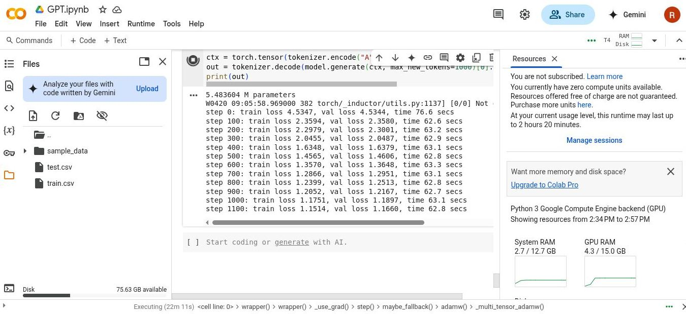

# GPT101
Getting started with GPT for language modeling. 

This project is based on the GPT implementation by Andrej Karpathy, i.e., [nanoGPT](https://github.com/karpathy/nanoGPT). The code has been adapted and extended for learning purposes and fun. The GPT model is trained on various speeches given by Donald Trump, with the goal of generating text in a similar style.


<h3 align="center">Run on Google Colab (No GPU Required)</h3>
<p align="center">
    
    <br />
    <sup>You can run this notebook directly on Google Colab, even if you don't have a GPU!</sup>
</p>


## Todo
- [ ] Experiment with more advanced text tokenizers
- [ ] Train on a larger dataset
- [ ] Deploy a simple web demo for interactive text generation
- [ ] Clean and preprocess training data more effectively
- [ ] Implement a basic attention visualization


## Dependencies
1. PyTorch (tested with version 2.6.0+cu124)
2. [jonaskoenig/trump_administration_statement](https://huggingface.co/datasets/jonaskoenig/trump_administration_statement) dataset


## Training Loss
```
5.483604 M parameters
step 0: train loss 4.4782, val loss 4.4783, time 60.9 secs
step 100: train loss 2.3640, val loss 2.3625, time 46.8 secs
step 200: train loss 2.2856, val loss 2.2878, time 48.0 secs
step 300: train loss 1.8098, val loss 1.8136, time 48.0 secs
step 400: train loss 1.5441, val loss 1.5477, time 48.8 secs
step 500: train loss 1.4174, val loss 1.4218, time 48.6 secs
step 600: train loss 1.3381, val loss 1.3457, time 48.7 secs
step 700: train loss 1.2862, val loss 1.2951, time 48.4 secs
step 800: train loss 1.2424, val loss 1.2534, time 48.4 secs
step 900: train loss 1.2094, val loss 1.2208, time 48.9 secs
step 1000: train loss 1.1849, val loss 1.1985, time 48.5 secs
step 1100: train loss 1.1578, val loss 1.1713, time 48.2 secs
step 1200: train loss 1.1433, val loss 1.1587, time 48.7 secs
step 1300: train loss 1.1261, val loss 1.1401, time 48.3 secs
step 1400: train loss 1.1142, val loss 1.1319, time 48.8 secs
step 1500: train loss 1.1022, val loss 1.1194, time 48.3 secs
step 1600: train loss 1.0906, val loss 1.1080, time 48.5 secs
step 1700: train loss 1.0801, val loss 1.1020, time 48.9 secs
step 1800: train loss 1.0742, val loss 1.0956, time 48.6 secs
step 1900: train loss 1.0699, val loss 1.0918, time 48.4 secs
step 2000: train loss 1.0589, val loss 1.0821, time 48.6 secs
step 2100: train loss 1.0512, val loss 1.0752, time 48.4 secs
step 2200: train loss 1.0461, val loss 1.0691, time 48.9 secs
step 2300: train loss 1.0387, val loss 1.0643, time 48.4 secs
step 2400: train loss 1.0311, val loss 1.0573, time 48.3 secs
step 2500: train loss 1.0260, val loss 1.0540, time 48.8 secs
step 2600: train loss 1.0246, val loss 1.0529, time 48.3 secs
step 2700: train loss 1.0194, val loss 1.0471, time 48.6 secs
step 2800: train loss 1.0157, val loss 1.0469, time 48.5 secs
step 2900: train loss 1.0105, val loss 1.0421, time 48.2 secs
step 3000: train loss 1.0077, val loss 1.0384, time 48.9 secs
step 3100: train loss 1.0028, val loss 1.0365, time 48.3 secs
step 3200: train loss 0.9991, val loss 1.0328, time 48.3 secs
step 3300: train loss 1.0010, val loss 1.0352, time 48.6 secs
step 3400: train loss 0.9889, val loss 1.0231, time 48.6 secs
step 3500: train loss 0.9887, val loss 1.0234, time 48.6 secs
step 3600: train loss 0.9871, val loss 1.0242, time 48.3 secs
step 3700: train loss 0.9772, val loss 1.0128, time 48.4 secs
step 3800: train loss 0.9776, val loss 1.0157, time 48.9 secs
step 3900: train loss 0.9743, val loss 1.0105, time 48.4 secs
step 4000: train loss 0.9709, val loss 1.0094, time 48.5 secs
step 4100: train loss 0.9674, val loss 1.0070, time 48.6 secs
step 4200: train loss 0.9675, val loss 1.0070, time 48.4 secs
step 4300: train loss 0.9620, val loss 1.0025, time 48.6 secs
step 4400: train loss 0.9595, val loss 1.0001, time 48.4 secs
step 4500: train loss 0.9582, val loss 0.9997, time 48.2 secs
step 4600: train loss 0.9560, val loss 0.9986, time 48.8 secs
step 4700: train loss 0.9521, val loss 0.9954, time 48.3 secs
step 4800: train loss 0.9495, val loss 0.9907, time 48.3 secs
step 4900: train loss 0.9515, val loss 0.9959, time 48.4 secs
step 4999: train loss 0.9478, val loss 0.9923, time 48.3 secs
```


## Generated Text
```
American companies commitment that theyve never have before weve been.
 Im going to spend his historic duty and socialism qualifically for people and would go some very schoolf.
The President from the respective of testing appoint to extend their own our American trustance throughs ot our cherishdaie.
They magnees it are we can increase that control American hard by far and percent.
Will be any safe?
Bout it commenting today will endeavor where they people contrus first jobs at all you met him.
And your next week, thanks Administratior is soifor-of-quality, and our two cellective reford to critizens will defund long it frally.
America is together. We seek to advance finally something that will be overlations a certain of cuts tax cut reading Americans stronge.
We are only going to reaciously provide unites, naboratories and ournautomate opportunity medical scients to allow overserved free and sherific ties under the respect thrad.
So your frthere we got into Trumply lead.
And in a serio
```


## References
1. Andrej Karpathy's [nanoGPT](https://github.com/karpathy/nanoGPT)
2. Vaswani, Ashish, Noam Shazeer, Niki Parmar, Jakob Uszkoreit, Llion Jones, Aidan N. Gomez, Łukasz Kaiser, and Illia Polosukhin. "Attention is all you need." Advances in neural information processing systems 30 (2017).
3. [Attention in transformer by 3Blue1Brown](https://www.youtube.com/watch?v=eMlx5fFNoYc)
